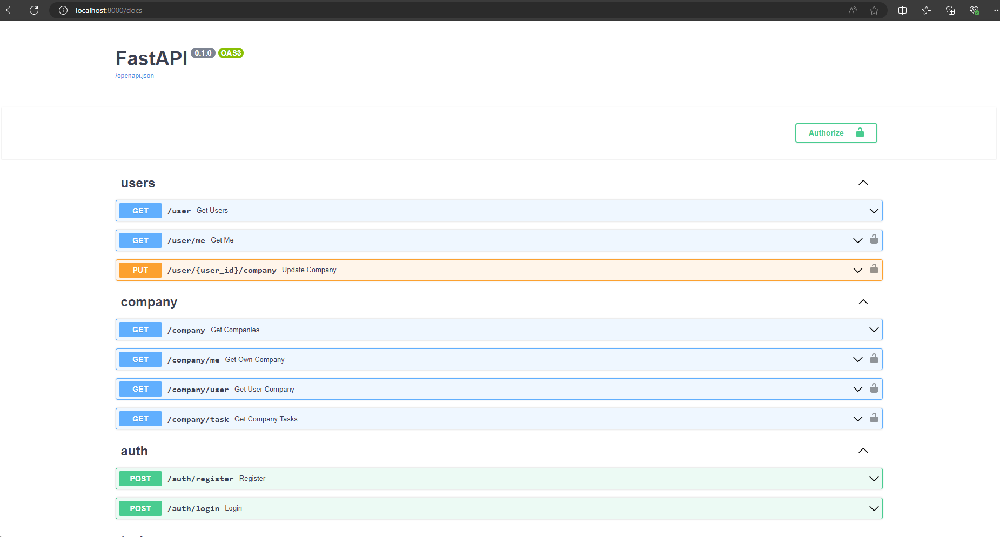
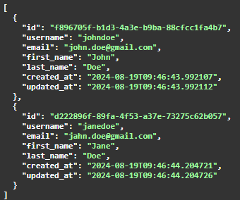
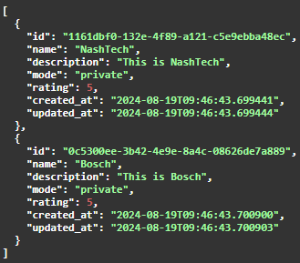

# Nashtech FastAPI Assignment

## Setup
Install <a href="https://docs.docker.com/engine/install/ubuntu/" target="_blank">Docker</a> and run <code>docker compose up</code>

After, access to <a href="http://localhost:8000/docs" 
target="_blank">localhost</a>, it will show the api document page.

  

If you would like to test the API, there are already two users and two companies, each of whom is also a company admin. Their password is <code>adsvjbjsdfff</code> and is configured in the <code>docker-compose.yml</code> file.

  

  

Regard,
Le Dang Minh